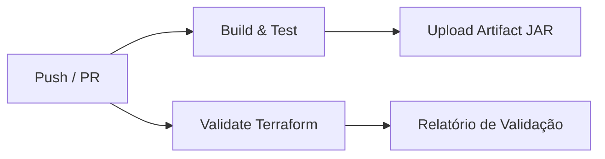
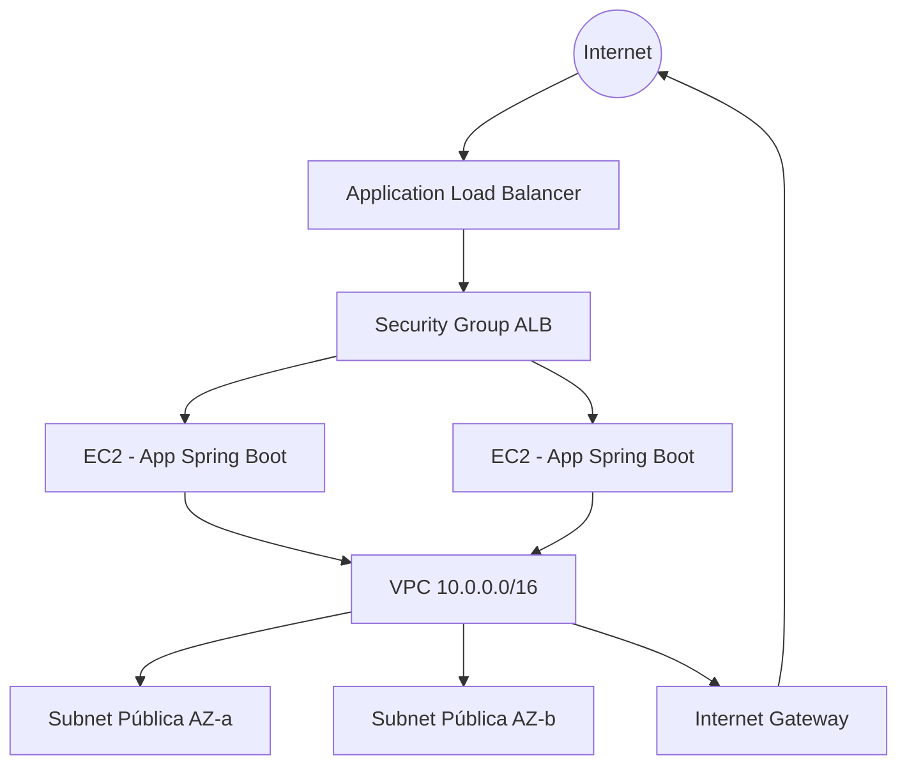

# Fase 1: Configuração Inicial e Automação

## 1. Descrição do Projeto

### Contexto

O **Desafio-IaC** é uma aplicação web desenvolvida em **Java 21** com **Spring Boot 4**, destinada a demonstrar boas práticas de DevOps por meio de integração contínua (CI) e infraestrutura como código (IaC).

A aplicação expõe endpoints REST e documentação OpenAPI (Swagger), servindo como artefato de referência para build, testes automatizados e provisionamento de infraestrutura na AWS.

### Objetivos

- Automatizar o ciclo de build e testes da aplicação via **GitHub Actions**.
- Documentar o plano de integração contínua e as especificações de infraestrutura.
- Provisionar a infraestrutura base na AWS utilizando **Terraform**.
- Garantir qualidade mínima do código com testes automatizados integrados ao pipeline.

### Requisitos Funcionais

| ID | Requisito |
|----|-----------|
| RF01 | A aplicação deve responder em endpoints REST (`/api/health`, `/api/info`). |
| RF02 | A aplicação deve expor endpoint de health check (`/actuator/health`). |
| RF03 | A documentação da API deve estar disponível via Swagger UI. |

### Requisitos Não Funcionais

| ID | Requisito |
|----|-----------|
| RNF01 | Pipeline CI deve executar em push e pull request para `main`. |
| RNF02 | Build deve falhar se algum teste automatizado falhar. |
| RNF03 | Infraestrutura deve ser reprodutível e versionada em código. |
| RNF04 | Scripts IaC devem ser validados no pipeline (fmt + validate). |

---

## 2. Plano de Integração Contínua (CI)

### Estratégia

O pipeline de CI é implementado com **GitHub Actions** e dividido em jobs paralelos e sequenciais para garantir feedback rápido e cobertura completa.

### Fluxo do Pipeline



### Etapas Detalhadas

#### Job 1: `build-and-test`

| Etapa | Descrição |
|-------|-----------|
| Checkout | Clona o repositório |
| Setup Java 21 | Configura JDK Temurin 21 com cache Maven |
| Build & Test | Executa `./mvnw verify` no diretório `Desafio-IaC` |
| Upload Artifact | Publica o JAR gerado como artefato do workflow |

#### Job 2: `terraform-validate`

| Etapa | Descrição |
|-------|-----------|
| Checkout | Clona o repositório |
| Setup Terraform | Instala Terraform 1.9.x |
| Format Check | Verifica formatação com `terraform fmt -check` |
| Init & Validate | Executa `terraform init -backend=false` e `terraform validate` |

### Gatilhos (Triggers)

- **Push** para branches `main` e `develop`
- **Pull Request** direcionado à branch `main`

### Artefatos Gerados

- JAR da aplicação (`Desafio-IaC-0.0.1-SNAPSHOT.jar`)
- Relatórios de teste Maven (Surefire)

### Critérios de Sucesso

- Compilação sem erros
- 100% dos testes automatizados passando
- Terraform validado sem erros de sintaxe ou referência

---

## 3. Especificação de Infraestrutura

### Visão Geral

A infraestrutura é provisionada na **AWS** utilizando **Terraform**, seguindo arquitetura de rede em camadas com alta disponibilidade básica em duas zonas de disponibilidade.

### Diagrama de Arquitetura



### Recursos Provisionados

| Recurso | Descrição | Finalidade |
|---------|-----------|------------|
| VPC | Rede `10.0.0.0/16` | Isolamento de rede |
| Subnets Públicas | 2 subnets em AZs distintas | Distribuição de instâncias |
| Internet Gateway | Acesso à internet | Comunicação externa |
| Security Group (ALB) | Portas 80/443 | Tráfego HTTP/HTTPS |
| Security Group (App) | Porta 8080 | Tráfego da aplicação Spring |
| Application Load Balancer | ALB público | Balanceamento de carga |
| Target Group | Health check `/actuator/health` | Monitoramento de instâncias |
| EC2 Instances | `t3.micro` Amazon Linux 2023 | Execução da aplicação |
| IAM Role | Permissões para EC2 | Acesso a serviços AWS |

### Variáveis Configuráveis

| Variável | Padrão | Descrição |
|----------|--------|-----------|
| `aws_region` | `us-east-1` | Região AWS |
| `project_name` | `desafio-iac` | Prefixo dos recursos |
| `environment` | `dev` | Ambiente (dev/staging/prod) |
| `instance_type` | `t3.micro` | Tipo da instância EC2 |
| `app_port` | `8080` | Porta da aplicação Spring Boot |

### Outputs

- URL do Load Balancer (`alb_dns_name`)
- IDs das instâncias EC2
- ID da VPC e subnets

### Pré-requisitos para Deploy

1. Conta AWS com credenciais configuradas
2. Par de chaves EC2 criado na região alvo
3. Terraform >= 1.5 instalado localmente ou via CI

### Comandos de Provisionamento

```bash
cd FASE-01/terraform
cp terraform.tfvars.example terraform.tfvars
# Edite terraform.tfvars com seus valores

terraform init
terraform plan
terraform apply
```

---

## 4. Repositório GitHub

**Repositório:** [https://github.com/SEU_USUARIO/lauro-iac](https://github.com/SEU_USUARIO/lauro-iac)

> Substitua `SEU_USUARIO` pelo seu usuário/organização no GitHub após publicar o repositório.

### Estrutura do Repositório

```
lauro-iac/
├── .github/workflows/fase-01-ci.yml   # Pipeline de CI
├── Desafio-IaC/                       # Aplicação Spring Boot
├── FASE-01/
│   ├── PLANEJAMENTO.md                # Este documento
│   └── terraform/                     # Scripts IaC (Terraform)
├── FASE-02/                           # Fase 2 (CD, containers, etc.)
└── README.md                          # Visão geral do projeto
```

---

## 5. Testes Automatizados

| Teste | Tipo | Descrição |
|-------|------|-----------|
| `DesafioIaCApplicationTests` | Integração | Valida carregamento do contexto Spring |
| `HealthControllerTest` | Integração (MockMvc) | Valida endpoint `/api/health` |
| `InfoControllerTest` | Integração (MockMvc) | Valida endpoint `/api/info` |
| `ActuatorHealthTest` | Integração (MockMvc) | Valida endpoint `/actuator/health` |

Todos os testes são executados automaticamente no pipeline CI a cada push ou pull request.
