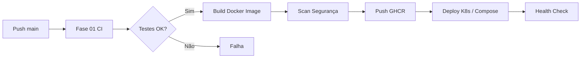

# Fase 2: Entrega Contínua, Monitoramento e Segurança

## 1. Objetivos

Expandir a automação da Fase 1 para cobrir **entrega contínua (CD)**, **containerização**, **orquestração**, **monitoramento**, **logging** e **segurança** da aplicação **Desafio-IaC**.

## 2. Escopo

| Item | Descrição |
|------|-----------|
| CD Pipeline | Extensão do CI com build de imagem Docker e deploy automatizado |
| Containerização | Dockerfile multi-stage otimizado para Spring Boot |
| Orquestração | Docker Compose (local) + Kubernetes (produção) |
| Monitoramento | Prometheus + Grafana |
| Segurança | Scan de imagem, secrets, políticas de rede |
| Relatório | Documentação final com fluxograma e melhorias futuras |

## 3. Plano de Entrega Contínua

### Fluxo CD

### Etapas do Pipeline (`fase-02-cd.yml`)

1. **Build & Test** — reutiliza validação Maven
2. **Docker Build** — constrói imagem a partir de `FASE-02/docker/Dockerfile`
3. **Security Scan** — Trivy scan na imagem
4. **Push Registry** — publica no GitHub Container Registry (GHCR)
5. **Deploy** — aplica manifests Kubernetes (manual approval em prod)

## 4. Containerização

### Dockerfile (multi-stage)

- **Stage 1 (build):** Maven + JDK 21 compila o JAR
- **Stage 2 (runtime):** JRE 21 slim executa a aplicação

### Orquestração Local (Docker Compose)

Serviços:
- `app` — aplicação Spring Boot (porta 8080)
- `prometheus` — coleta métricas (porta 9090)
- `grafana` — dashboards (porta 3000)

## 5. Orquestração Kubernetes

Manifests em `FASE-02/kubernetes/`:

| Arquivo | Recurso |
|---------|---------|
| `namespace.yaml` | Namespace `desafio-iac` |
| `configmap.yaml` | Configurações da aplicação |
| `deployment.yaml` | Deployment com 2 réplicas |
| `service.yaml` | ClusterIP + LoadBalancer |
| `ingress.yaml` | Roteamento HTTP externo |

## 6. Monitoramento e Logging

- **Métricas:** Spring Actuator expõe `/actuator/prometheus`
- **Prometheus:** scrape interval 15s
- **Grafana:** datasource Prometheus pré-configurado
- **Logs:** stdout/stderr capturados pelo runtime (Docker/K8s)

## 7. Segurança

Consulte [seguranca/POLITICAS-SEGURANCA.md](seguranca/POLITICAS-SEGURANCA.md):

- Imagem roda como usuário não-root
- Scan de vulnerabilidades no pipeline (Trivy)
- Secrets via GitHub Secrets / K8s Secrets
- Network policies documentadas

## 8. Entregáveis

| Entregável | Localização |
|------------|-------------|
| Pipeline CD | `.github/workflows/fase-02-cd.yml` |
| Dockerfile | `FASE-02/docker/Dockerfile` |
| Orquestração | `FASE-02/docker-compose.yml`, `FASE-02/kubernetes/` |
| Fluxograma | `FASE-02/docs/FLUXOGRAMA-DEVOPS.md` |
| Relatório Final | `FASE-02/RELATORIO-FINAL.md` (exportar para PDF) |

## 9. Repositório GitHub

**Repositório:** [https://github.com/SEU_USUARIO/lauro-iac](https://github.com/SEU_USUARIO/lauro-iac)
