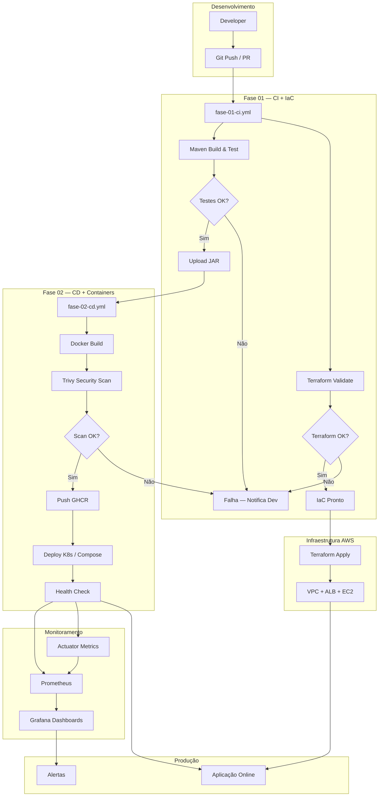
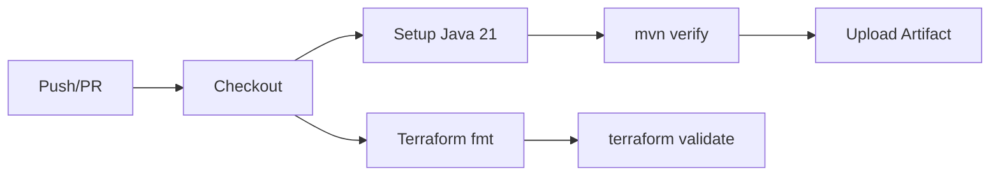
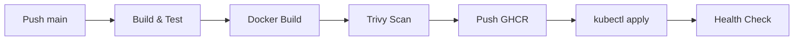
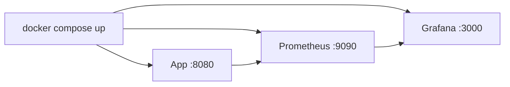

# Fluxograma DevOps — Pipeline Completo

Diagrama integrado das Fases 1 e 2: do desenvolvimento ao deploy em produção.

## Visão Geral

## Pipeline CI (Fase 1)

## Pipeline CD (Fase 2)

## Fluxo de Deploy Local

## Legenda

| Símbolo | Significado |
|---------|-------------|
| Retângulo | Etapa do pipeline |
| Losango | Decisão / gate |
| Subgrafo | Fase ou ambiente |
